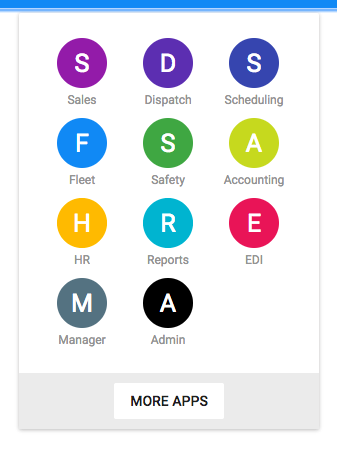

# AppBarBoard [Repo](https://github.com/React-Quiver/AppBarBoard)

AppBarBoard written with React.

## Getting started
```
npm install
npm start
```

## Description
Application board in react.




## Documentation
Check the complete documentation and working example in React-Quiver doc website.
